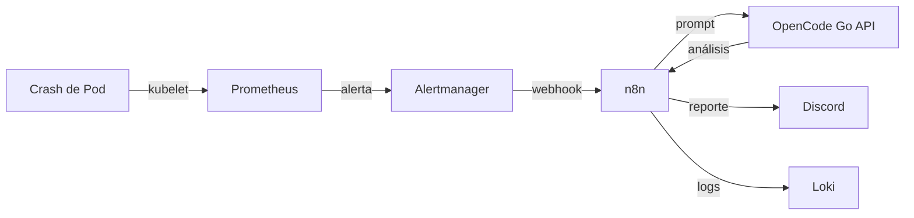
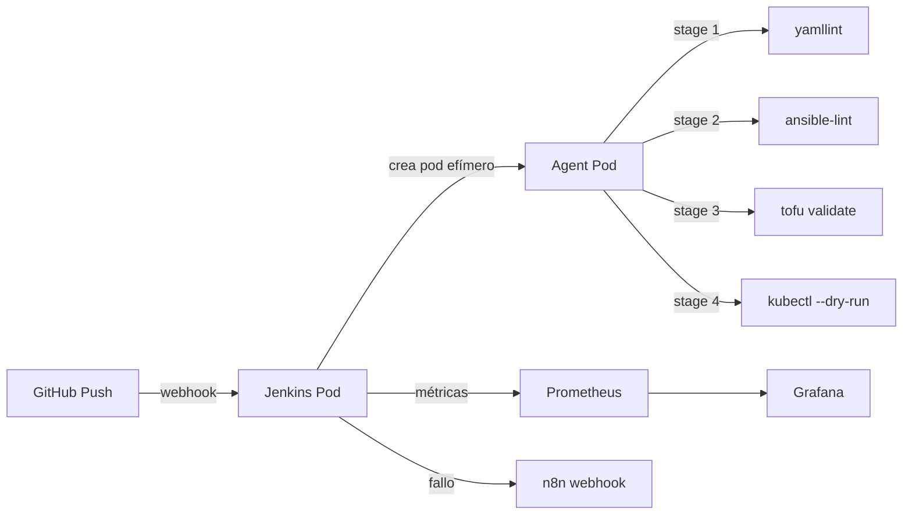

# rocky-linux-aiops-lab

> Self-hosted ITOps automation platform on Rocky Linux — from local k3s lab to Oracle Cloud Free Tier. n8n orchestrates incident response with LLM analysis via OpenCode Go, deployed with Ansible + OpenTofu, secrets managed with HashiCorp Vault, CI/CD with Jenkins + GitOps with ArgoCD, and production hardening for OCI.

## Stack Tecnológico

| Capa | Tecnología | Notas |
|---|---|---|
| OS | Rocky Linux 9 | RHEL-based, ecosistema RPM |
| Seguridad base | SELinux enforcing + firewalld | Diferencia clave vs Ubuntu/UFW |
| Secrets management | HashiCorp Vault | Reemplaza Kubernetes Secrets en base64 |
| Provisioning | Ansible | Roles de hardening RHEL |
| IaC | OpenTofu | Fork open source de Terraform, provider Kubernetes |
| Orquestación | k3s | Kubernetes certificado, single-node, ARM64 |
| Métricas | Prometheus + Alertmanager | Alertmanager cierra el loop con n8n |
| Logs | Loki + Grafana Alloy | Alloy es el sucesor oficial de Promtail |
| Dashboards | Grafana | Métricas, logs y ejecuciones de n8n |
| Automatización | n8n | Orquestador de workflows de ITOps |
| LLM | OpenCode Go API | Endpoint compatible OpenAI, modelos DeepSeek/Kimi/Qwen |
| CI/CD | Jenkins (k3s) + GitHub Actions | Jenkins self-hosted para pipelines, GitHub Actions para lint y CI |
| GitOps | ArgoCD | Sync automático de manifiestos desde GitHub a k3s |
| Cloud | Oracle Cloud Free Tier | 4 vCPUs ARM, 24 GB RAM, $0/mes |
| SRE | SLO/SLI + fail2ban + dnf-automatic | Confiabilidad medida, hardening de producción |

## Estado del Proyecto

- [x] **Fase 1**: Base del Sistema — Rocky Linux + Hardening RHEL
- [x] **Fase 2**: Infrastructure as Code — OpenTofu
- [x] **Fase 3**: Secrets Management — HashiCorp Vault
- [x] **Fase 4**: K3s + Stack de Observabilidad
- [x] **Fase 5**: Workflows de Automatización con n8n
- [x] **Fase 6**: CI/CD — Jenkins Self-Hosted en k3s
- [ ] **Fase 7**: GitOps con ArgoCD
- [ ] **Fase 8**: Seguridad para Producción (fail2ban + dnf-automatic + NSG)
- [ ] **Fase 9**: Migración a Oracle Cloud Free Tier
- [ ] **Fase 10**: SLO/SLI + Documentación Final + Demo grabada

> **Nota:** La Fase 3 (Vault) se ejecuta después de la Fase 4 porque Vault se despliega dentro de k3s. El README marca la Fase 4 como completada antes que la 3 por esta dependencia lógica.

## Diferencias clave: Rocky Linux / RHEL vs Ubuntu

| Concepto | Ubuntu | Rocky Linux / RHEL |
|---|---|---|
| Firewall | UFW | firewalld (zones + services) |
| SELinux | Desactivado por defecto | Enforcing por defecto |
| Paquetes | apt / dpkg | dnf / rpm |
| SSH service | ssh | sshd |
| Gestión de servicios | systemd | systemd (igual) |
| Repositorios | PPA | EPEL, CRB |

## Inicio Rápido

### Prerrequisitos

- Rocky Linux 9 (ARM64) corriendo en UTM o similar
- Acceso SSH con clave configurado (puerto 2222)
- Ansible instalado en la máquina de control (Mac)
- k3s corriendo en la VM (ver sección Fase 4)

### Ejecutar el playbook de hardening

```bash
cd ansible
ansible-playbook playbooks/site.yml
```

### Idempotencia

Correr el playbook dos veces y confirmar que el segundo run no reporta cambios:

```bash
ansible-playbook playbooks/site.yml
ansible-playbook playbooks/site.yml  # Segunda corrida — no debería haber cambios
```

## Estructura del Repositorio

```
rocky-linux-aiops-lab/
├── README.md
├── .github/workflows/
├── ansible/
│   ├── inventory/hosts.yml
│   ├── roles/
│   │   ├── system-base/
│   │   ├── firewalld/
│   │   ├── selinux/
│   │   ├── ssh-hardening/
│   │   └── vault-agent/
│   └── playbooks/site.yml
├── tofu/
│   ├── main.tf
│   ├── variables.tf
│   └── outputs.tf
├── k3s/manifests/
│   ├── namespace.yml
│   ├── prometheus/
│   │   ├── serviceaccount.yml    # RBAC para kubernetes_sd_configs
│   │   ├── configmap.yml         # Prometheus config + alert rules
│   │   ├── deployment.yml + PVC
│   │   ├── service.yml
│   │   └── node-exporter.yml     # DaemonSet para métricas del host
│   ├── alertmanager/
│   │   ├── configmap.yml
│   │   ├── deployment.yml
│   │   └── service.yml
│   ├── loki/
│   │   ├── configmap.yml
│   │   ├── deployment.yml
│   │   ├── service.yml
│   │   └── pvc.yml
│   ├── alloy/
│   │   ├── configmap.yml
│   │   ├── daemonset.yml
│   │   ├── service.yml
│   │   ├── serviceaccount.yml
│   │   └── rbac.yml
│   ├── grafana/
│   │   ├── configmap.yml              # Datasources + dashboard provider
│   │   ├── dashboard-configmap.yml   # Cluster Overview dashboard JSON
│   │   ├── deployment.yml             # Con annotations de Vault Agent Injector
│   │   ├── service.yml
│   │   ├── ingress.yml
│   │   ├── serviceaccount.yml         # ServiceAccount para Vault auth
│   │   ├── pvc.yml
│   │   └── secret.yml                 # ⚠️ Obsoleto — reemplazado por Vault
│   ├── n8n/
│   │   ├── configmap.yml
│   │   ├── deployment.yml             # Con annotations de Vault Agent Injector
│   │   ├── service.yml
│   │   ├── ingress.yml
│   │   ├── serviceaccount.yml         # ServiceAccount para Vault auth
│   │   ├── pvc.yml
│   │   ├── secret.yml                 # ⚠️ Obsoleto — reemplazado por Vault
│   │   ├── workflows/                 # Workflows limpios (sin secrets)
│   │   └── workflows-local/           # Workflows con credenciales (gitignoreado)
│   └── vault/
│       ├── ...
│       ├── setup-vault.sh
│   └── jenkins/
│       ├── deployment.yml
│       ├── service.yml
│       ├── pvc.yml
│       ├── rbac.yml
│       ├── serviceaccount.yml
│       └── configmap.yml
├── Jenkinsfile
└── docs/
```

## IaC Declarativa vs Configuration Management (Fase 2)

| Concepto | Ansible (CM) | OpenTofu (IaC) |
|---|---|---|
| Paradigma | Procedural — pasos en orden | Declarativo — estado deseado |
| Estado | No rastrea estado internamente | Mantiene state file (terraform.tfstate) |
| Idempotencia | Manual — el playbook la implementa | Automática — `tofu apply` solo aplica diff |
| Drift detection | No — corre todo otra vez | Sí — `tofu plan` muestra drift |
| Recreación | No — si un cambio falla, queda a medias | Sí — si un recurso se elimina manualmente, `tofu apply` lo recrea |
| Cuándo usar | Configurar paquetes, servicios, usuarios del SO | Definir recursos cloud/K8s (namespaces, deployments, PVC) |

Son complementarios: OpenTofu crea los recursos, Ansible los configura.

## Fase 2 — OpenTofu: flujo de trabajo

```bash
cd tofu
tofu init       # Inicializa providers
tofu plan       # Muestra qué va a crear/drift
tofu apply      # Aplica los cambios
tofu show       # Inspecciona el state
tofu destroy    # Elimina todo (ciclo completo)
```

Recursos definidos:
- `kubernetes_namespace.aiops` — namespace `aiops` con labels
- `kubernetes_config_map.prometheus` — configuración de Prometheus + alert rules
- `kubernetes_config_map.grafana` — datasources de Grafana (Prometheus + Loki)

## Conceptos de Secrets Management (Fase 3)

| Concepto | Descripción |
|---|---|
| Kubernetes Secret | Codifica datos en base64 — **no es cifrado**. Cualquiera con acceso al cluster puede leerlos. |
| HashiCorp Vault | Almacena secrets cifrados y controla el acceso con políticas RBAC. |
| Vault Agent Injector | Webhook que detecta annotations en pods y añade un init container que obtiene secrets de Vault. |
| kv-v2 | Backend de Vault para almacenar pares clave-valor versionados (`secret/data/grafana`). |
| Kubernetes Auth Method | Permite que pods se autentiquen con Vault usando su ServiceAccount JWT. |
| Vault Policy | Documento HCL que define qué paths puede leer/escribir un rol (`path "secret/data/grafana" { capabilities = ["read"] }`). |
| Vault Role | Vincula un ServiceAccount de K8s a una política de Vault (`bound_service_account_names=grafana`). |
| `__FILE` suffix | Convención de Grafana: `GF_SECURITY_ADMIN_PASSWORD__FILE` lee la contraseña desde un archivo. |

### Dev mode vs Producción

| Aspecto | Modo Dev (este lab) | Producción |
|---|---|---|
| Almacenamiento | En memoria (se pierde al reiniciar) | Raft/Consul (persistente) |
| Unseal | Automático (no requiere claves) | Manual (3 de 5 unseal keys) |
| Root token | Fijado por env var (`dev-root-token`) | Generado en `vault operator init` |
| TLS | Deshabilitado (HTTP) | Obligatorio (HTTPS) |
| Audit logging | Deshabilitado | Recomendado |
| Datos sensibles | No cifrados en reposo | Cifrados con Shamir |

### Flujo de inyección de secrets

```
Pod creation request (con annotations de Vault)
        │
        ▼
┌─────────────────────────────┐
│  MutatingWebhook (Injector) │  ← Intercepta la creación del pod
│  vault.hashicorp.com/*      │
└─────────────┬───────────────┘
              │
              ▼
┌─────────────────────────────┐
│  Modifica el pod spec:      │
│  1. Añade init container     │
│     (vault-agent-init)       │
│  2. Añade volumen emptyDir   │
│     (vault-secrets)          │
│  3. Monta /vault/secrets/    │
└─────────────┬───────────────┘
              │
              ▼
┌─────────────────────────────┐
│  vault-agent-init ejecuta:  │
│  1. Lee token del SA del pod│
│  2. Se autentica con Vault  │
│  3. Obtiene secrets         │
│  4. Escribe en /vault/secrets│
└─────────────┬───────────────┘
              │
              ▼
┌─────────────────────────────┐
│  Contenedor principal arranca│
│  y lee secrets del archivo: │
│  - Grafana: __FILE          │
│  - n8n: source .env file   │
└─────────────────────────────┘
```

## Fase 3 — HashiCorp Vault: despliegue

### Despliegue automatizado

```bash
# Script que genera certificados TLS, despliega Vault + Injector,
# configura Kubernetes auth, políticas y secrets:
chmod +x k3s/manifests/vault/setup-vault.sh
./k3s/manifests/vault/setup-vault.sh

# Redesplegar Grafana y n8n con annotations de Vault:
kubectl apply -f k3s/manifests/grafana/
kubectl apply -f k3s/manifests/n8n/
```

### Componentes de Vault

| Componente | Imagen | Función |
|---|---|---|
| Vault Server | `hashicorp/vault:1.16.2` | Almacena y gestiona secrets (modo dev) |
| Vault Agent Injector | `hashicorp/vault-k8s:1.4.2` | Webhook que inyecta init containers en pods |
| Config Job | `hashicorp/vault:1.16.2` | Configura auth, políticas y secrets iniciales |

### Verificación

```bash
# Verificar que Vault está corriendo:
kubectl get pods -n aiops -l app=vault

# Acceder a la UI de Vault:
kubectl port-forward -n aiops svc/vault 8200:8200
# Abrir http://localhost:8200 (token: dev-root-token)

# Verificar que los secrets existen:
kubectl exec -n aiops vault-0 -- vault kv list secret/
kubectl exec -n aiops vault-0 -- vault kv get secret/grafana
kubectl exec -n aiops vault-0 -- vault kv get secret/n8n

# Verificar que los pods leen secrets de Vault:
kubectl logs -n aiops -l app=grafana -c vault-agent-init
kubectl logs -n aiops -l app=n8n -c vault-agent-init
```

### Rotación de secrets

```bash
# Re-ejecutar el Job de configuración regenera los secrets:
kubectl delete job vault-config -n aiops
kubectl apply -f k3s/manifests/vault/config-job.yml

# ⚠️ En modo dev, los datos se pierden si Vault reinicia.
# Re-ejecutar el Job restaura la configuración.
```

---

## Conceptos de Kubernetes (Fase 4)

| Concepto | Descripción |
|---|---|
| Pod | Unidad mínima, uno o más contenedores |
| Deployment | Define cuántas réplicas correr y cómo actualizarlas |
| DaemonSet | Un pod por cada nodo del cluster — usado por Alloy y Node Exporter |
| Service | Expone un pod internamente en el cluster (ClusterIP) |
| Ingress | Expone servicios fuera del cluster — Traefik en k3s por defecto |
| ConfigMap | Configuración no sensible montada como archivos |
| Secret | Configuración sensible (passwords) codificada en base64 |
| PVC | Almacenamiento persistente — k3s usa local-path por defecto |
| Namespace | Separación lógica — todos los servicios en `aiops` |

## Fase 4 — k3s + Stack de Observabilidad

### Instalación de k3s

```bash
# En la VM Rocky Linux:
curl -sfL https://get.k3s.io | sh -

# Verificar:
sudo kubectl get nodes
sudo kubectl get pods -A

# Copiar kubeconfig para acceso desde la Mac:
scp -P 2222 rocky-aiops:/etc/rancher/k3s/k3s.yaml ~/.kube/config
# Editar server: cambiar 127.0.0.1 por la IP de la VM
```

### Desplegar el stack

```bash
# Desde la Mac, con kubeconfig apuntando a la VM:
kubectl apply -f k3s/manifests/namespace.yml

# Observabilidad (en orden de dependencia):
kubectl apply -f k3s/manifests/prometheus/
kubectl apply -f k3s/manifests/alertmanager/
kubectl apply -f k3s/manifests/loki/
kubectl apply -f k3s/manifests/alloy/
kubectl apply -f k3s/manifests/grafana/

# Automatización:
kubectl apply -f k3s/manifests/n8n/
```

### Arquitectura del stack

```
                    ┌──────────────────────────────────────────────┐
                    │              Mac (navegador)                 │
                    │   grafana.local ──► Grafana Ingress :80    │
                    │   n8n.local ──────► n8n Ingress :80        │
                    └──────────┬───────────────────────────────────┘
                               │
                    ┌──────────┴───────────────────────────────────┐
                    │           k3s cluster (aiops ns)            │
                    │                                             │
                    │  ┌───────────────────────────────────────┐ │
                    │  │    HashiCorp Vault (secrets)          │ │
                    │  │    ┌────────────┐  ┌─────────────────┐ │ │
                    │  │    │ Vault Server│  │Vault Agent      │ │ │
                    │  │    │ :8200       │  │Injector (webhook)│ │ │
                    │  │    │ secretes ─► │  │ inyecta init ct │ │ │
                    │  │    │ ┌────────┐  │  │ en pods con     │ │ │
                    │  │    │ │grafana │  │  │ annotations     │ │ │
                    │  │    │ │n8n     │  │  │                 │ │ │
                    │  │    │ └────────┘  │  └─────────────────┘ │ │
                    │  │    └────────────┘                     │ │
                    │  └───────────────────────────────────────┘ │
                    │                    │ inyecta secrets        │
                    │                    ▼                        │
                    │  ┌─────────────┐    ┌──────────────────┐  │
                    │  │ Prometheus   │───►│  Alertmanager    │  │
                    │  │ :9090       │    │  :9093            │  │
                    │  └──┬──────────┘    └───────┬──────────┘  │
                    │     │ scrape              │ webhook        │
                    │  ┌──┴──────────┐    ┌──────┴──────────┐  │
                    │  │Node Exporter │    │     n8n          │  │
                    │  │ :9100       │    │  :5678 /metrics  │  │
                    │  └─────────────┘    └─────────────────┘  │
                    │                                             │
                    │  ┌─────────────┐    ┌──────────────────┐  │
                    │  │  Grafana    │    │  Alloy (DaemonSet)│  │
                    │  │ :3000       │◄───│  recolecta logs  │  │
                    │  └──────┬──────┘    └───────┬──────────┘  │
                    │         │ datasource        │ push logs    │
                    │  ┌──────┴──────┐    ┌───────┴──────────┐  │
                    │  │ Prometheus  │    │    Loki           │  │
                    │  │ :9090       │    │  :3100            │  │
                    │  └─────────────┘    └──────────────────┘  │
                    └─────────────────────────────────────────────┘
```

### Servicios desplegados

| Servicio | Imagen | Puerto | Función |
|---|---|---|---|
| Prometheus | prom/prometheus:v2.51.0 | 9090 | Scrape y almacenamiento de métricas |
| Node Exporter | prom/node-exporter:v1.7.0 | 9100 | Métricas del host (CPU, memoria, disco) |
| Alertmanager | prom/alertmanager:v0.27.0 | 9093 | Routing de alertas a n8n |
| Loki | grafana/loki:2.9.6 | 3100 | Almacenamiento y query de logs |
| Alloy | grafana/alloy:v1.1.0 | 12345 | Recolección de logs de pods |
| Grafana | grafana/grafana:10.4.1 | 3000 | Dashboards y visualización |
| n8n | n8nio/n8n:2.22.2 | 5678 | Orquestación de workflows |
| Vault | hashicorp/vault:1.16.2 | 8200 | Gestión de secrets cifrados (dev mode) |
| Vault Injector | hashicorp/vault-k8s:1.4.2 | 443 | Webhook de inyección de secrets en pods |
| Jenkins | jenkins/jenkins:2.492.3-lts | 8080 | CI/CD self-hosted con agentes dinámicos |

## Fase 5 — Workflows de Automatización con n8n ✅

### Resumen

Fase completada. Se construyó el diferenciador central del proyecto: el loop automatizado `crash → Prometheus → Alertmanager → n8n → LLM → Discord`. Cuatro workflows de ITOps orquestan el análisis inteligente de alertas, logs y health checks usando la API de OpenCode Go (DeepSeek V4 Flash). Todos los workflows fueron probados end-to-end.

### Arquitectura del flujo end-to-end



### Workflows implementados

| Workflow | Trigger | Función | Estado |
|---|---|---|---|
| **Test Connection** | Manual | Valida conectividad a OpenCode Go antes de activar workflows productivos | ✅ |
| **Incident Response** | Webhook (`/webhook/alertmanager`) | Recibe alertas de Alertmanager, analiza con LLM y notifica a Discord | ✅ |
| **Log Analysis** | Cron (cada hora) | Consulta Loki, resume errores con LLM y envía reporte a Discord | ✅ |
| **Health Check** | Cron (cada 5 min) | Consulta K8s API (pods en namespace aiops), filtra fallas, analiza con LLM y notifica Discord. Si no hay fallos, loguea "healthy" a Loki | ✅ |

### Credenciales

Las credenciales de OpenCode Go, Discord y el token de ServiceAccount de K8s se almacenan en Vault y se inyectan en runtime vía Vault Agent Injector (`deployment.yml`).

- `secret/n8n` → `N8N_ENCRYPTION_KEY`
- `secret/n8n/credentials` → `N8N_OPENCODE_API_KEY`, `N8N_DISCORD_WEBHOOK_URL`
- El token de K8s se lee desde `/var/run/secrets/kubernetes.io/serviceaccount/token`

**Limitación conocida en n8n 2.22.2:** `$env.VAR` no se resuelve correctamente en headers de nodos HTTP Request cuando se usa como expresión. Como workaround:

- Los workflows productivos se importan con credenciales hardcodeadas desde `workflows-local/` (gitignoreado, **no se sube al repo**).
- Los archivos en `workflows/` contienen placeholders (`SK_REPLACE_ME_...`, `DISCORD_WEBHOOK_ID/...`, `K8S_SA_TOKEN_PLACEHOLDER`) y son seguros para commitear.

### Acceso a n8n

El Service de n8n está expuesto como **NodePort** en el puerto **30522**:

```
http://192.168.64.21:30522
```

No requiere port-forward. Alternativamente, usar `n8n.local` con el Ingress si el DNS está configurado.

### Cómo importar los workflows

1. Accedé a la UI de n8n en `http://192.168.64.21:30522`.

2. Andá a **Workflows → Add Workflow → Import from File**.

3. Importá desde `k3s/manifests/n8n/workflows-local/` (versiones con credenciales reales, gitignoreadas) o desde `k3s/manifests/n8n/workflows/` (versiones limpias con placeholders, requieren completar credenciales manualmente).

4. Activá los workflows con el toggle **Active**.

### Incident Simulation — paso a paso

Para probar sin crash real:

```bash
curl -X POST http://192.168.64.21:30522/webhook/alertmanager \
  -H "Content-Type: application/json" \
  -d '{"commonLabels":{"alertname":"HighCPUUsage","severity":"critical"},"commonAnnotations":{"description":"CPU al 95% en node-1 hace 5 minutos"}}'
```

Para simular un crash real (el flujo completo):

1. **Forzar un crash:** `kubectl delete pod -n aiops -l app=grafana --force`
2. **Prometheus detecta** que el pod no responde y genera una alerta.
3. **Alertmanager** enruta la alerta vía webhook a n8n.
4. **n8n** ejecuta el workflow *Incident Response*, extrae el contexto y llama a OpenCode Go API.
5. **El LLM** devuelve: causa probable, comandos sugeridos y prioridad.
6. **Discord** recibe el mensaje con el análisis completo (truncado a 1900 chars si excede).

### Infraestructura de soporte validada

- **Alertmanager**: receptor `n8n-webhook` → `http://n8n.aiops.svc.cluster.local:5678/webhook/alertmanager`
- **RBAC de n8n**: `ClusterRole n8n-pod-reader` con `get/list/watch` sobre pods, vinculado al `ServiceAccount n8n`
- **Vault Agent Injector**: inyecta `N8N_ENCRYPTION_KEY` y credenciales externas desde Vault
- **ConfigMap**: `N8N_BLOCK_ENV_ACCESS_IN_NODE: "false"` para permitir `$env` en Code nodes
- **PVC**: `n8n-pvc` (1Gi) para persistencia de la base SQLite y workflows
- **Service**: NodePort 30522 para acceso directo sin port-forward

### Fixes aplicados durante la fase

- **Encryption key mismatch**: Vault tenía una key distinta a la del config de n8n, causando CrashLoopBackOff. Solución: sincronizar la key real desde el config existente hacia Vault (`vault kv patch secret/n8n`).
- **`require('fs')` bloqueado en Code nodes**: el sandbox del JS Task Runner de n8n 2.x no permite `fs`. Solución: mover la lógica de armado de bodies a Code nodes y usar `specifyBody: "json"` + `jsonBody: {{ JSON.parse($json.llmBody) }}` en los HTTP Request.
- **`$env.VAR` en headers de HTTP Request**: no evalúa correctamente en n8n 2.22.2. Solución: hardcodear credenciales para uso local (workflows-local) y mantener placeholders en el repo.
- **Límite de 2000 caracteres en Discord**: el análisis del LLM puede ser muy extenso. Solución: truncar a 1900 chars en los Code nodes que arman el mensaje.
- **IF node type mismatch**: `boolean` en el IF node no matchea correctamente contra expresiones que evalúan a boolean desde un Code node. Solución: retornar `hasFailures` como string (`'true'/'false'`) y usar comparación `string equals true`.

## Fase 6 — CI/CD con Jenkins Self-Hosted ✅

### Resumen

Jenkins self-hosted corriendo como pod en el cluster k3s, con agentes dinámicos que se crean y destruyen por cada build. Complementa GitHub Actions del Proyecto 1, demostrando conocimiento de CI/CD tanto managed como self-hosted.

### Arquitectura



### Componentes desplegados

| Componente | Descripción |
|---|---|
| **Jenkins Deployment** | 1 réplica, imagen `jenkins/jenkins:2.492.3-lts`, PVC 5Gi |
| **Init Container** | Instala plugins: kubernetes, workflow-aggregator, git, github, ansicolor, prometheus |
| **Init Script (Groovy)** | Configura security realm y crea usuario admin automáticamente |
| **Service NodePort** | UI en `30580`, JNLP en `30500` |
| **RBAC (Role)** | Permisos sobre pods, pods/exec, pods/log en namespace aiops |
| **Prometheus scrape** | `/prometheus` en `jenkins.aiops.svc.cluster.local:8080` |

### Diferencias clave: Jenkins vs GitHub Actions

| | GitHub Actions | Jenkins |
|---|---|---|
| Hosting | Managed por GitHub | Self-hosted, vos lo gestionás |
| Configuración | YAML en `.github/workflows/` | `Jenkinsfile` en el repo |
| Visibilidad | Solo en GitHub | Dashboard propio |
| Runners | Efímeros, managed | Pods dinámicos en el cluster |
| Dónde vive | Nube de GitHub | Pod en tu cluster |

### Pipeline (`Jenkinsfile`)

El pipeline definido en `Jenkinsfile` ejecuta 4 stages en agentes dinámicos:

1. **Lint YAML** — `yamllint` sobre `k3s/manifests/`
2. **Lint Ansible** — `ansible-lint` sobre `ansible/playbooks/` y `ansible/roles/`
3. **Validate OpenTofu** — `tofu validate` sobre `tofu/`
4. **Validate K8s Manifests** — `kubectl --dry-run=client` sobre todos los YAML

En caso de fallo, el bloque `post { failure }` envía un webhook a n8n para respuesta automática.

### Acceso

- **URL**: `http://<host>:30580`
- **Usuario**: `admin`
- **Password**: `admin123`
- **Métricas Prometheus**: `http://<host>:30580/prometheus`

### Archivos creados

```
k3s/manifests/jenkins/
├── deployment.yml
├── service.yml
├── pvc.yml
├── rbac.yml
├── serviceaccount.yml
└── configmap.yml
Jenkinsfile
```

## Lecciones Aprendidas

### n8n
- **El sandbox del JS Task Runner es restrictivo**: no permite `require('fs')` ni acceso al filesystem. Cualquier lectura de archivos debe hacerse antes del arranque y exportarse como variable de entorno.
- **`$env` en headers de HTTP Request no funciona en 2.22.2**: es necesario hardcodear o usar Code nodes intermedios como proxy de variables de entorno.
- **El CLI `import:workflow` tiene bugs con ciertos formatos JSON**: siempre importar desde la UI para garantizar integridad del workflow.
- **Vault Agent Injector es confiable**: las variables inyectadas aparecen correctamente en `/proc/<pid>/environ` del proceso n8n, pero el sandbox del task runner no las hereda.

### Jenkins
- **El init container de plugins es mas confiable que install-plugins.sh en caliente**: al ejecutar jenkins-plugin-cli antes de que Jenkins arranque, los plugins estan disponibles desde el primer inicio.
- **-Djenkins.install.runSetupWizard=false deshabilita tambien la creacion del admin**: Jenkins arranca con SecurityRealm$None. Es necesario un script init.groovy.d que configure HudsonPrivateSecurityRealm y cree el usuario administrador.
- **El Groovy sandbox tiene restricciones de classloader**: no se pueden referenciar clases internas como SecurityRealm$None directamente. Usar comparacion por nombre de clase como workaround.

### General
- **SQLite + PVC es suficiente para lab single-node**: no requiere PostgreSQL ni Redis para queue mode si solo hay 1 réplica.
- **La encryption key de n8n debe persistir entre reinicios**: si Vault genera una nueva key, n8n no arranca porque la DB está cifrada con la anterior. Solución: persistir la key real en Vault, no regenerarla.
- **El webhook de Alertmanager a n8n funciona con el Service DNS interno** (`n8n.aiops.svc.cluster.local`), no requiere exponer n8n externamente para este flujo.